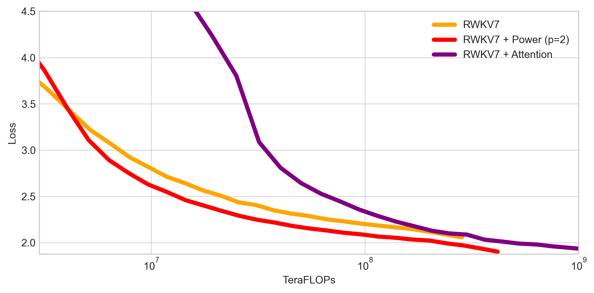
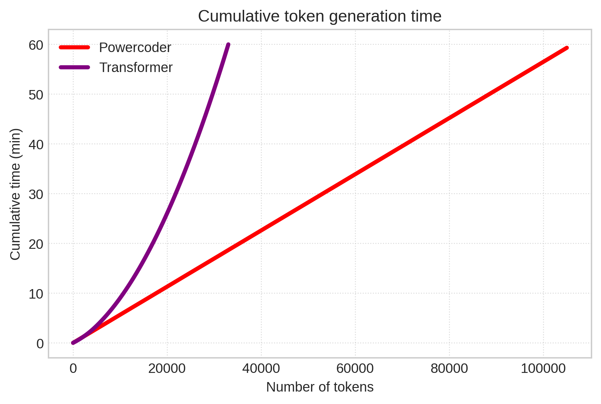

# Retention
[](https://github.com/m-a-n-i-f-e-s-t/retention/actions/workflows/build-and-test.yml)

This repository contains a PyTorch layer implementing power retention, a linear-cost variant of attention whose state size can be controlled
independently of context length and parameter count.

For details on the approach, see our paper: [Scaling Context Requires Rethinking Attention](http://arxiv.org/abs/2507.04239)

Documentation: [https://m-a-n-i-f-e-s-t.github.io/retention/](https://m-a-n-i-f-e-s-t.github.io/retention/)


### Training Performance

On a wide range of FLOPs budgets, power retention models achieve the lowest perplexity. 


### Inference Performance
In a head-to-head comparison on long-context generation, power retention models like [PowerCoder](HUGGINGFACE_URL) are able to attain vastly greater token througput than transformers.



*(Measured above is a 3B-parameter models on an A100, with prefill length of 2048.)*

### Features

- Efficient chunked algorithm for linear scaling with sequence length (O(t) cost vs O(t²) for standard attention)
- Support for gated attention and rotary embeddings
- CUDA kernels optimized for A100
- FP16 and BF16 support


## Installation

### From PyPI (Recommended)
```bash
pip install retention
```

### From Source
Requirements:
- Python 3.11 or 3.12 (3.13 depends on the upcoming [Triton 3.2 release](https://github.com/triton-lang/triton/issues/5215))
- CUDA Toolkit 12.4
- GCC/G++ with C++17 support
- Linux (Windows/MacOS not supported)

```bash
git clone https://github.com/manifest-ai/retention.git
cd retention
pip install -e .
```

All other dependencies (PyTorch, Ninja build system, etc.) will be automatically installed through pip.

## Usage

For practical deployment guideline, refer to [deployment](https://github.com/m-a-n-i-f-e-s-t/retention/tree/main/deploy#readme).

### Training
The main entry point is the `power_retention` function, which implements symmetric power retention. Here's a basic example:

```python
import torch
from retention import power_retention

# Create input tensors
batch_size = 2
seq_len = 1024
num_heads = 8
head_dim = 64

Q = torch.randn(batch_size, seq_len, num_heads, head_dim, device='cuda', dtype=torch.float16)
K = torch.randn_like(Q)
V = torch.randn_like(Q)

# Optional gating tensor
log_G = torch.nn.functional.logsigmoid(
    torch.randn(batch_size, seq_len, num_heads, dtype=torch.float32, device='cuda')
)

# Compute retention results
output = power_retention(
    Q=Q, K=K, V=V, 
    log_G=log_G,          # Optional gating tensor
    deg=2,                # Power parameter p
    chunk_size=128,       # Size of chunks for processing long sequences
)
```

### Inference

For inference, a separate interface `power_retention_inference` is provided, which allows for constant-time token generation regardless of context size.

```python
import torch
from retention import power_retention_inference

# Create input tensors
batch_size = 2
seq_len = 2048
num_heads = 8
head_dim = 64

Q = torch.randn(batch_size, 1, num_heads, head_dim, device='cuda', dtype=torch.bfloat16)
K = torch.randn(batch_size, seq_len, num_heads, head_dim, device='cuda', dtype=torch.bfloat16)
V = torch.randn_like(K)

# Optional gating tensor
log_G = torch.nn.functional.logsigmoid(
    torch.randn(batch_size, seq_len, num_heads, dtype=torch.float32, device='cuda')
)

# Calling inference without initial state
out, state, sum_of_keys = power_retention_inference(
  Q=Q, K=K, V=V, log_G=log_G,
  initial_state=None,          # initial state to be queried from
  sum_of_keys=None,            # initial normalization factor
  deg=2,                       # Power parameter p
  switch_over_seq_len=1024     # minimum sequence length to trigger state update
)
```
The first call to `power_retention_inference` usually provides `K`, `V` as the arguments, since there's no initial state. Once the sequence size of `K` and `V` grows beyond the `switch_over_seq_len`, a state update will happen, converting `K, V` of shape `batch x seq_len x num_heads x head_dim` into a state of shape `batch x num_heads x D x head_dim`, where `D` is controlled by the power parameter `p`. `sum_of_keys` are the accumulated normalization factor, having a shape of `batch x num_heads x D`.

You always need to keep the state and sum_of_keys around for the next inference call, just like KV cache. However, they size do not grow with context size, unlike KV cache.

```python
# Calling inference again, with initial state, with a new key and new value
Q = torch.randn(batch_size, 1, num_heads, head_dim, device='cuda', dtype=torch.bfloat16)
K = torch.randn_like(Q)
V = torch.randn_like(Q)

# Optional gating tensor
log_G = torch.nn.functional.logsigmoid(
    torch.randn(batch_size, 1, num_heads, dtype=torch.float32, device='cuda')
)

new_out, new_state, new_sum_of_keys = power_retention_inference(
  Q=Q, K=K, V=V, log_G=log_G,
  initial_state=state,         # initial state to be queried from
  sum_of_keys=sum_of_keys,     # initial normalization factor
  deg=2,                       # Power parameter p
  switch_over_seq_len=1024     # minimum sequence length to trigger state update
)
```

### Integration with Transformer Models

The package includes a drop-in replacement for standard attention in transformer models.
See `train/model.py` for a complete example of using power retention in a GPT-style model:

```python
from retention import power_retention

class CausalSelfAttention(nn.Module):
    def __init__(self, config):
        super().__init__()
        # ... initialization code ...
        
    def forward(self, x):
        # ... projection code ...
        
        # Use power retention instead of standard attention
        y = power_retention(
            Q=q, K=k, V=v, 
            log_G=log_g,
            deg=self.degree,
            chunk_size=self.chunk_size
        )
        
        # ... output projection ...
        return y
```

## Development

### Setup

The package uses pip's editable install mode for development. First, activate your Python virtual environment, then:

```bash
# Install base package in editable mode
pip install -e .

# Install development dependencies
pip install psutil
pip install flash_attn==2.7.3 --no-build-isolation
pip install -e .[dev]
```

### Testing & Benchmarking

Run correctness tests:

```bash
pytest
```

Run benchmarks:

```bash
python -m perf.benchmark fwd          // Forward pass
python -m perf.benchmark bwd          // Backward pass
python -m perf.benchmark fwd+bwd      // Forward + backward pass
```

See [benchmark](https://github.com/m-a-n-i-f-e-s-t/retention/tree/main/perf/README.md) for details.

### Documentation

To view the documentation locally, run:

```bash
pip install mkdocs mkdocs-material
.venv/bin/mkdocs serve -a 0.0.0.0:8000
```

To update it publicly, run:
```bash
mkdocs gh-deploy
```

### Training Example

To immediately see the kernel in action, `cd deploy` and use:

```bash
python train.py \
  --batch_size=2 \
  --block_size=16384 \
  --chunk_size=1024
```


## Contributing

We welcome contributions! Here's how you can help:

### Getting Started

1. Fork the repository
2. Create a new branch for your feature/fix: `git checkout -b feature-name`
3. Install development dependencies: `pip install -e .[dev]`

### Guidelines

- **Code Style**: Follow PEP 8 for Python code. For CUDA code, follow the existing style in the codebase
- **Documentation**: Add docstrings to new functions and update README if needed
- **Testing**: Add tests for new features and ensure all tests pass
- **Benchmarking**: If your code changes affect performance, delete the `plots/benchmark_results` and rerun some benchmarks with `python -m perf.benchmark fwd+bwd`
- **Commits**: Write clear, concise commit messages
- **Performance**: For CUDA kernels, include benchmarks showing performance impact

### Pull Request Process

1. Update documentation for any new features
2. Add or update tests as needed
3. Ensure all tests pass: `pytest`
4. Run benchmarks if performance-critical code was changed: `python3 -m perf.benchmark fwd+bwd`
5. Create a Pull Request with a clear description of changes
6. Wait for review and address any feedback

### Areas for Contribution

- Performance optimizations for different GPU architectures
- Documentation improvements
- Bug fixes
- Test coverage improvements

For major changes, please open an issue first to discuss what you would like to change.

## Release Process

1. Update the version in `pyproject.toml`
2. Run `pytest` and benchmarks if applicable
3. Run `make release-test` to build & push to Test PyPI for all Python targets
4. Run `make release` to build & push to PyPI for all Python targets

## Citation

If you use this code in your research, please cite:

```bibtex
@article{buckman2024symmetric,
  title={Symmetric Power Transformers},
  author={Buckman, Jacob and Gelada, Carles and Zhang, Sean},
  publisher={Manifest AI},
  year={2024},
  month={8},
  url={https://manifestai.com/articles/symmetric-power-transformers/}
}
```

## License

Apache 2.0 (see [LICENSE](LICENSE))
