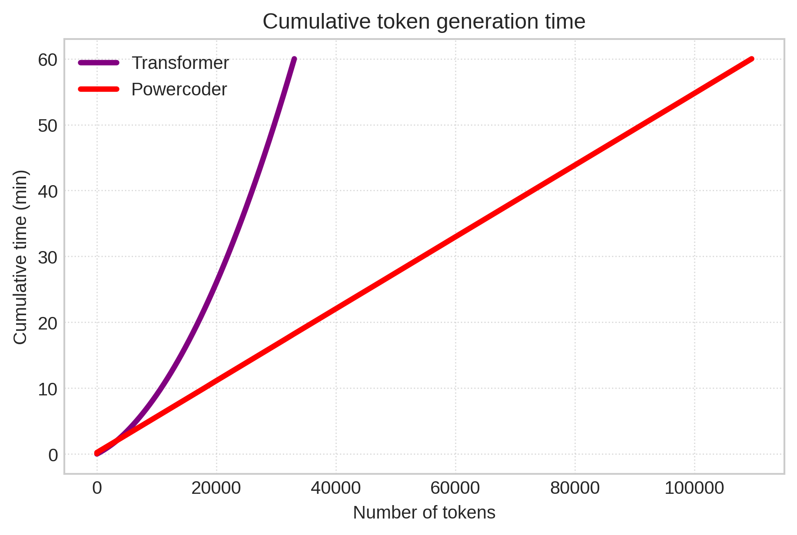

# Deploy Power Retention

This directory contains example code to train, generate, serve a power-retention-backed model.


*(Cumulative token generation time for PowerCoder, with and without chunking enabled )*

All examples here uses [PowerCoder](https://huggingface.co/manifestai/powercoder-3b), which is a Llama-based model adapted from *bigcode/starcoder2-3b* and trained on additional coding data, using power retention.


## Env setup

First, clone the repository

```bash
git clone git@github.com:m-a-n-i-f-e-s-t/retention.git
```

Install all dependencies using uv
```bash
uv init --seed
uv sync --all-extras
source .venv/bin/activate
```

## Training

To train a PowerCoder model using power retention on huggingface datasets (the default uses `'karpathy/tiny_shakespeare`), simply run

```bash
python train.py
```

For other datasets, it's recommended to change the dataloader's `collate_fn` correspondingly.

## Generate

To generate using a pretrained model (e.g., `manifestai/powercoder-3b`), 

```bash
python generate.py # interact with the model
python generate.py --input-file <file> # prompt the model using a file
python generate.py --input "def bubble_sort(" # prompt the model directly
```

the last command will output something like the following:

```bash
arr):
    for i in range (len(arr)-1,0,-1) :
        for j in range(i-1, -2*(-j), 3 ) :
            if arr[j] > arr [j+1]:
                temp = arr[j]; 
                arr[j]=arr[j + 1 ];  
                arr[j+1 ]=temp;
Stats:
Time to first token: 2.35s
Tokens per second: 41.17s ± 3.20
Tokens generated: 84
Prompt tokens: 5
Total tokens: 89
Total time: 4.37s
```

### Measure Generation Speed

To compare an retention-based model and an attention-based model in terms of token genertaion speed, run the following command

```bash
python generate.py --input-file train.py --no-eos --stats-only --max-new-tokens 8192 --model bigcode/starcoder2-3b
python generate.py --input-file train.py --no-eos --stats-only --max-new-tokens 8192 --model --switch-over-seq-len 1024
```
The first command uses the `train.py` file as prompt and uses the `bigcode/starcoder2-3b` model to generate 8192 new tokens (disregarding eos tokens as we only care about measurement). The second command uses PowerCoder for generation. Both commands writes the collected statistics into `generate_stats.json`.

To visualize the measurement result, run

```bash
python plot.py --generate_stats generate_stats.json --output generation_time.png
```

You can also fit a polynormial model to the measurment and project the total token generation time for more that the measured context size via

```bash
python plot.py --generate_stats generate_stats.json --output generation_time.png --extend 100000
```


## Serve Power Retention

To serve PowerCoder live, run the following command to spin up an openai-compatible server:

```bash
python serve.py
```

which then can be queried with a client (example provided in `client.py`).
